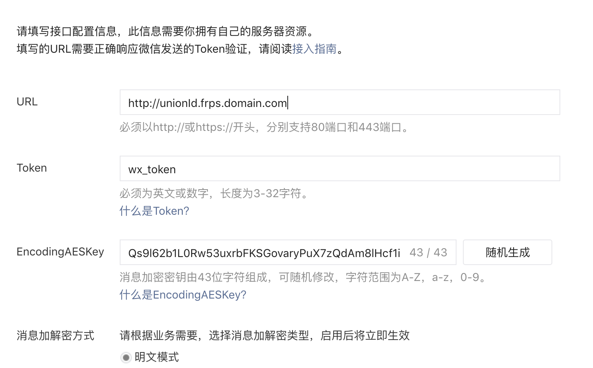

# 微信公众号

[TOC]


## 项目目的
> 为了避免节省开发成本，现将服务端与微信对接工作封装到一个项目中，暴露接口。
>
> 引入项目中只需要配置一些微信信息，即可只专注项目的业务逻辑，其余均交给此项目来完成。
>
> 实现接口，注入服务即可使用。

## 项目目录结构

```java
|-[yyx-wx]·····································父项目，公共依赖以及方便构建
|  |
|  |-[yyx-wx-butt]·····························公众号与开发者服务器对接的模块
|  |
|  |-[yyx-wx-commons]··························公众号公共模块：配置、异常、常量、实体
|  |
|  |-[yyx-wx-demo]·····························公众号使用例子：不用引，演示如何集成到项目中
|  |
|  |-[yyx-wx-manage]···························公众号管理模块
|  |
|  |-[yyx-wx-modules]
|  |  |
|  |  |-[yyx-wx-account]·······················公众号账号管理模块
|  |  |
|  |  |-[yyx-wx-message]·······················公众号推送到开发者服务器的消息处理模块
```


## 项目使用方法
> 配置好项目环境后即可使用，modules下的每个模块可单独引用。
## 项目使用环境
- 需要自己设置微信回调接口URL，**强调：该URL不需要经过URLEncode处理。**该配置使用在网页授权时才会用到

- 需要自己设置微信APP_ID和APP_SECRET以及CONFIG_TOKEN

    - APP_ID为微信公众号的appid
    - APP_SECRET是微信公众号中的secret
    - CONFIG_TOKEN是微信公众号开发配置中的令牌(Token)

- 配置用例：

    PS:**不会配置的看下边，再看下边。再看下边**

    - yml文件格式
    ```yml
    wx:
      url:
        redirect_uri: URI地址(http://domain/api/xx)
      public_number:
        app_id: appID
        app_secret: appSecret
        config_token: 开发者自定配置的token
    ```
    - properties
    ```properties
    wx.url.redirect_uri=URI地址(http://domain/api/xx)
    wx.public_number.app_id=appID
    wx.public_number.app_secret=appSecret
    wx.public_number.config_token=开发者自定配置的token
    ```


ps：
​	有朋友问我内网穿透，在这里我给出一个小小的简易的可以使用在项目中的教程。扩展内容不在这里赘述。

首先，从网站上下载frp这个软件

[frp下载地址](https://github.com/fatedier/frp/releases)

### 搭建公网服务器

首先将frp软件上传到自己的公网服务器中。并解压。

其次修改frps.ini这个配置文件

```shell
[common]
# 绑定服务器的端口号，这个端口用于客户端与服务器通信
bind_port = 99999
#  绑定Http协议使用的端口
vhost_http_port = 9998
# 开启特权模式
privilege_mode = true
# 特权停牌，客户端需要填写一致才能与服务器通信
privilege_token = frps.domain
# 设置服务器域名
subdomain_host = frps.domain.com
```

保存上述文件，

在服务器上设置99999端口与9998端口的防火墙例外。

如果是linux建议安装一个Screen用于处理远程不终结的会话。Screen使用暂且不在这里叙述。

启动frps服务

```shell
# 进入frps所在的目录下
./frps -c frps.ini
# 其中frps.ini就是刚刚修改的配置文件的绝对路径。
```

至此，公网服务器搭建完成

### 启动客户端程序

在本地，同样下载fpr软件，并解压，进入其目录中，修改frpc.ini配置文件

```shell
[common]
# 公网服务器的IP地址或者域名。
server_addr = 58.87.72.97
# 公网服务器frps.ini文件中设置的用于客户端与服务器通信的端口号 
server_port = 99999
# 公网服务器frps.ini文件中设置的token
privilege_token = frps.domain

# 如果自己使用，这里可以随便写，如果多人使用，需要注意这里不能和别人的相同。否则会出现冲突
[unionId]
# 本机的WEB服务使用的协议是HTTP协议
type = http
# 本机的WEB应用使用的端口号。
local_port = 80
# 此处与上方[unionId]方括号中的要一致，主要用于映射请求
subdomain = unionId
```
之后，将自己的域名解析中添加一条*.frps.domain.com的解析记录。如果只自己用，就解析unionId.frps.domain.com就可以了
至此，内网客户端就配置好了。启动方式如公网服务器启动方式差不多。

```shell
./frpc -c frpc.ini
```

当控制台出现

```shell
2019/01/16 21:06:34 [I] [proxy_manager.go:300] proxy removed: []
2019/01/16 21:06:34 [I] [proxy_manager.go:310] proxy added: [hyy]
2019/01/16 21:06:34 [I] [proxy_manager.go:333] visitor removed: []
2019/01/16 21:06:34 [I] [proxy_manager.go:342] visitor added: []
2019/01/16 21:06:34 [I] [control.go:246] [05caf72f7678a5ba] login to server success, get run id [05caf72f7678a5ba], server udp port [0]
2019/01/16 21:06:34 [I] [control.go:169] [05caf72f7678a5ba] [unionId] start proxy success
```

时，便代表与服务器通信成功。此时，访问unionId.frps.domain.com就可以访问到本机的一个端口号为80的WEB服务了。

unionId：本地fprc.ini文件中配置的subdomain

frps.domain：公网服务器frps.ini文件中配置的subdomain_host

此时，打开微信后台，开发菜单下，基本配置处配置自己的服务器地址unionId.frps.domain.com和与微信服务器通信的Token即可。



### 配置用例解析

在配置用例里有这么一段代码

```yml
wx:
  url:
    redirect_uri: URI地址(http://domain/api/xx)
```

这里配置的是用户授权之后，微信服务器使用code和state回调开发者服务器的接口路径。

domain即上述配置的unionId.frps.domain.com

api/auth/token就是接口路径，如果你的项目包含项目名，那就是projectName/api/auth/token

因为api是我在Demo的一个Controller的@RequestMapping

auth/token是我一个接口的@RequestMapping

当然，后期我会封装一下，倒是就只需要配置域名就好了。


**重中之重**

搞这些就是因为本机没有公网IP，在本地开发的一个方法。如果你有公网IP，且，你有自己的域名，且，域名已经备案了，那么就不需要搞这么多。

如果你没有公网IP，没有域名，那你就只使用 frpc -c frpc.ini直接连我这边搭好服务即可。当然，

**请记住，一定要把[unionId]给改掉，最好改成不重复的，因为一旦我发现我的不能用，我就会把你挤下去~我的ID是yyx！**